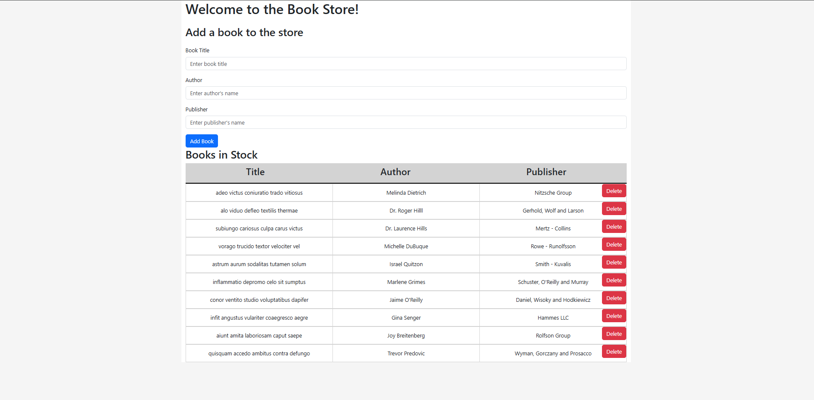

# Book Store Client application using the DOM

A responsive book store website built with HTML, CSS, and JavaScript that interacts with a remote bookstore API.

## Project Structure
```
book-store/
├── index.html # Main HTML file
├── styles.css # Stylesheet
└── app.js # Main JavaScript functionality
```

## Features

- Responsive design that works on mobile and desktop
- Dynamic content loading from API
- Interactive UI elements
- Ability to add new books to store
- Ability to delete existing books from the store

## Demo

Below is an image of an expected output, your project does not need to exactly look like this.



Below is a link to deployed site on GitHub pages if you want to see how the application functions.

[DOM Bookstore Deployed Project](https://npower-inc.github.io/bookstore_project_demo/)